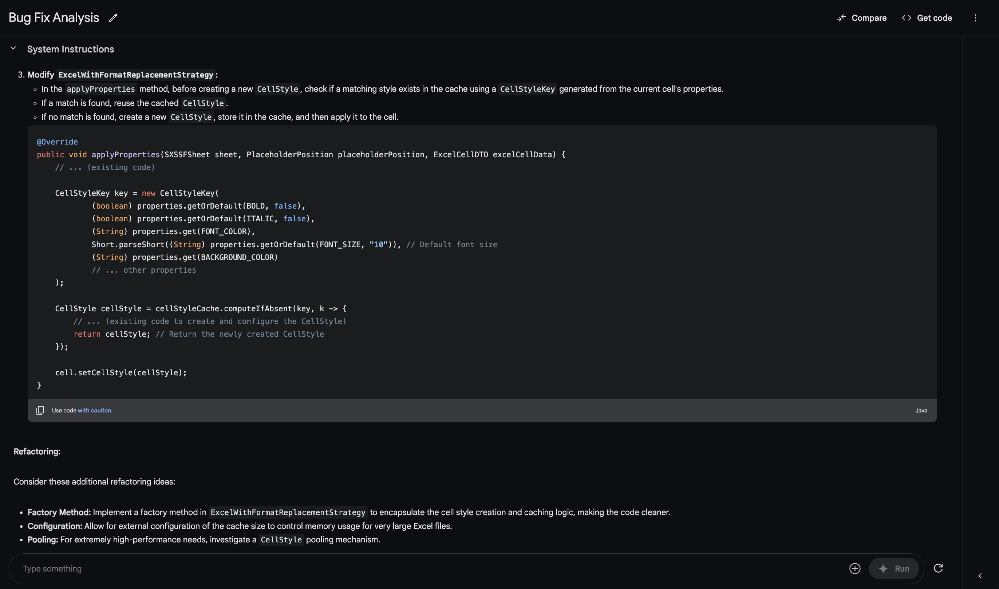

# LLM Prompts Playground for Coders

This is the repository which contains examples of using LLMs to help us with coding experience.

So far, the prompts were tested in Google LLMs, on Google AI Studio. Feel free to check how these works with others, like ChatGPT, Claude and others.

# Use cases

**Please, make sure you copy plain markdown, rather than formatted text!**

## Sugest a bug fix

Steps:
1) Open Google AI Studio https://aistudio.google.com/prompts/new_chat
2) Paste the first prompt - examplanation what you want to achieve: [fix-a-bug/1 - LL Experiments - Prompt - suggest bug fix](fix-a-bug/1%20-%20LL%20Experiments%20-%20Prompt%20-%20suggest%20bug%20fix.md)
3) Paste your exception, stacktrace or error: [fix-a-bug/2 - LLM Experiments - Prompt - Issue](fix-a-bug/2%20-%20LLM%20Experiments%20-%20Prompt%20-%20Issue.md)
4) Paste your code. For the example we use File Generator microservice which was converted into single file: [fix-a-bug/3 - LL Experiments - Prompt - just code](fix-a-bug/3%20-%20LL%20Experiments%20-%20Prompt%20-%20just%20code.md)

Example result:

## Suggest refactoring steps for given architecture

Steps:
1) Open Google AI Studio https://aistudio.google.com/prompts/new_chat
2) Paste the first prompt - examplanation what you want to achieve: [suggest-architecture-refactoring/1 - LL Experiments - Prompt - suggest architecture improvement](suggest-architecture-refactoring/1%20-%20LL%20Experiments%20-%20Prompt%20-%20suggest%20architecture%20improvement.md)
3) Your prompt: I want to use Layered Architecture for my Java Microservice which is supposed to generate files based on provided template.
4) Paste your code. For the example we use File Generator microservice which was converted into single file: [suggest-architecture-refactoring/2 - LL Experiments - Prompt - just code](suggest-architecture-refactoring/2%20-%20LL%20Experiments%20-%20Prompt%20-%20just%20code.md)
